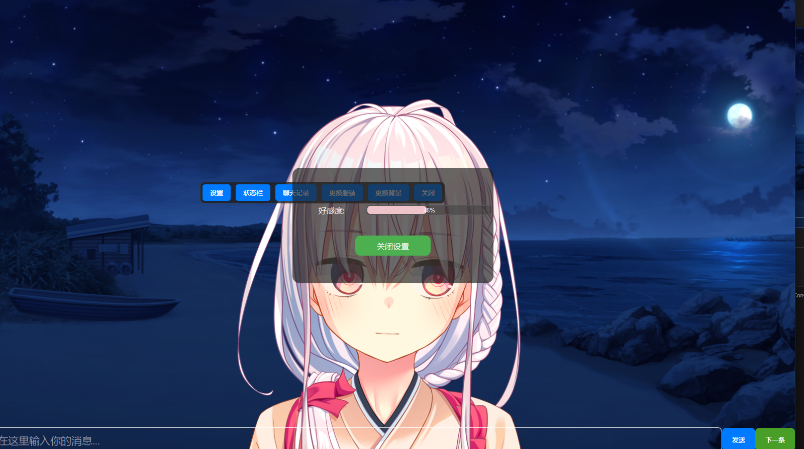

暂时没活了，所有这个项目也暂时弃坑
---

# Fumino - Galgame 式 AI 聊天界面

Fumino 是一个桌面应用程序，提供与 AI 角色的沉浸式聊天体验，旨在模拟视觉小说（Galgame）的交互风格。该界面高度动态化，通过集成大型语言模型（LLM）、语音合成（TTS）和视觉定制系统，为用户带来身临其境的互动感受。


## ✨ 功能特点

-   **动态视觉小说界面**:
    -   **角色与表情**: 可根据对话上下文，动态切换角色的表情。
    -   **可变场景**: 支持手动或由 LLM 自动控制更换背景，模拟场景变化。
    -   **沉浸式对话框**: 以视觉小说风格的对话框呈现角色回应。

-   **高级 LLM 集成**:
    -   **多模型支持**: 通过设置面板，可以轻松切换不同的 LLM 服务，如 Google 的 **Gemini** 和 智谱 AI (**质谱**)。
    -   **检索增强生成 (RAG)**: 利用向量数据库对历史对话进行检索，使 LLM 能生成更连贯、更贴合角色设定的回复。
    -   **环境控制能力**: LLM 可以通过在回复中插入特定指令，来控制界面元素，如更换背景或角色表情。

-   **语音合成 (TTS)**:
    -   为角色的对话生成并播放语音，使互动更加生动。TTS 服务的具体配置位于 `Get_TTS.py` 中，需要一个本地运行的服务端。

-   **好感度系统**:
    -   内置“好感度”状态栏，其数值可由 LLM 根据对话进展进行更新，直观反映用户与角色之间的关系状态。
      

-   **伪多条对话**:
    -   LLM 可以生成一组连续的对话，用户通过点击“下一条”按钮来逐句阅读，创造出类似游戏脚本的对话流。
      
      
      
      

-   **交互式定制**:
    -   用户可通过双击角色打开浮动菜单，手动更换角色的服装和当前场景的背景。
      

-   **聊天记录管理**:
    -   支持将当前对话保存到文件，加载之前的聊天记录，或清空当前对话，方便用户管理不同的故事线。

## 🚀 安装与配置

1.  **克隆仓库**:
    ```bash
    git clone https://github.com/your-username/Fumino.git
    cd Fumino
    ```

2.  **安装依赖**:
    建议使用虚拟环境。项目主要依赖 `PySide6`, `requests`, `google-generativeai`, `openai`, `librosa`, `sounddevice` 和 `numpy`。
    ```bash
    pip install -r requirements.txt
    ```
    *（注意：您可能需要根据您的代码自行创建一个 `requirements.txt` 文件）*

3.  **配置 API**:
    -   在项目根目录下创建一个 `config.json` 文件。
    -   您也可以直接运行程序，通过双击角色 -> "设置" 打开配置菜单，输入您的大模型 API Key 和用于 RAG 的 Embedding 服务 URL/Key。配置将自动保存到 `config.json`。

    `config.json` 示例:
    ```json
    {
        "api_key": "YOUR_GEMINI_OR_ZHIPU_API_KEY",
        "llm": "Gemini",
        "model": "gemini-1.5-flash-latest",
        "rag": true,
        "embed_url": "YOUR_EMBEDDING_SERVICE_URL",
        "embed_key": "YOUR_EMBEDDING_SERVICE_KEY"
    }
    ```

4.  **配置 TTS 服务器**:
    -   本项目需要一个在本地运行的 TTS 服务，并监听 `http://127.0.0.1:9880`。
    -   在启动应用前，请确保您的 TTS 服务已正常运行。您可以在 `Get_TTS.py` 文件中修改服务的 URL 和其他参数。

## ▶️ 如何使用

1.  **启动应用**:
    ```bash
    python main.py
    ```
2.  **与文乃互动**:
    -   在底部的输入框中键入消息，然后点击“发送”或按回车。
    -   **双击**角色区域，可以打开浮动选项菜单。
    -   在菜单中，您可以访问：
        -   **设置**: 配置 API 和选择模型。
        -   **状态栏**: 查看好感度。
        -   **聊天记录**: 保存、加载或清空对话。
        -   **更换服装** 和 **更换背景**: 自定义视觉元素。
